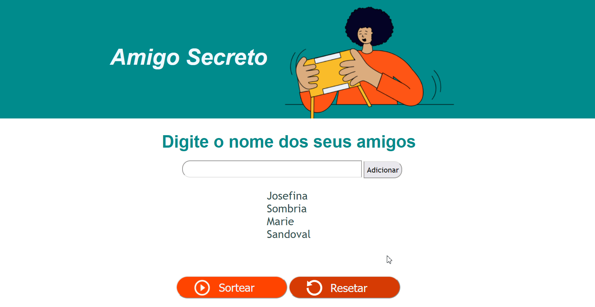

# Amigo Secreto #

## Sobre o projeto ##

Aplicação de sorteio aleatório de nomes desenvolvida em HTML, CSS e Javascript, como desafio da turma ONE da Alura/Oracle.

## Como funciona ##

Os nomes são adicionados a uma lista e depois sorteados aleatoriamente com uso do botão "sortear". O nome sorteado aparece na tela e em seguida é removido da lista. O sorteio pode ser resetado a qualquer momento ao apertar o botão "resetar".

